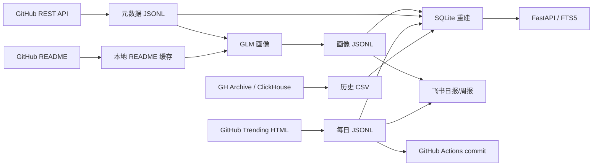
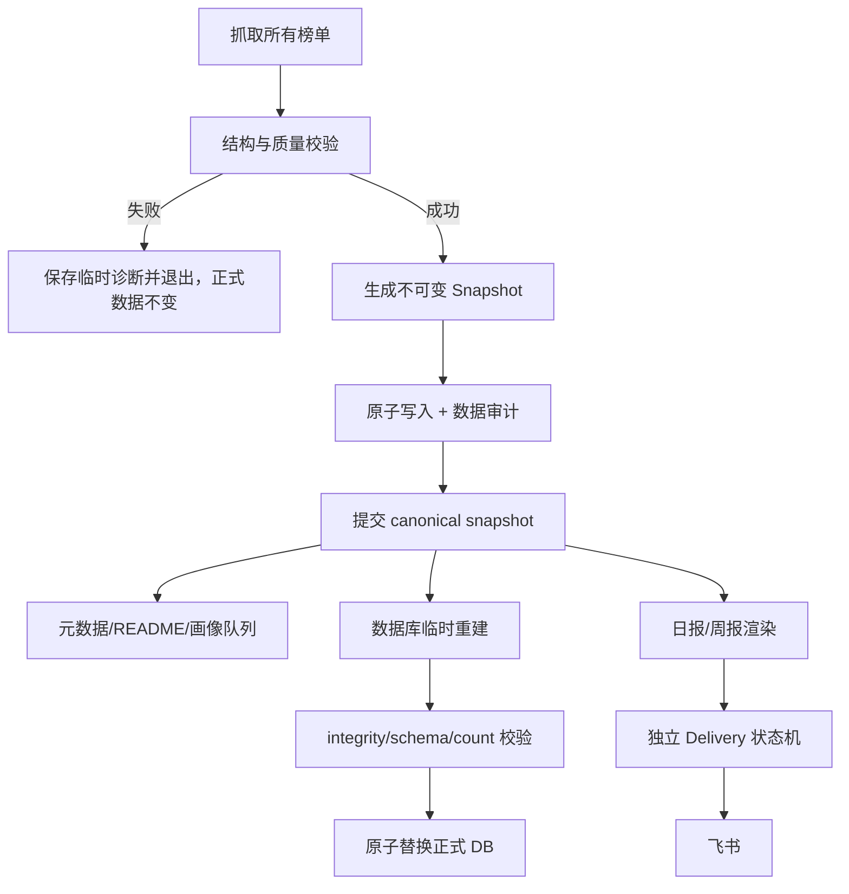

# GitHub 趋势榜知识库：全面 Review 与优化实施规格

> 用途：供 GLM 进行二次审核并据此实施。  
> 审查日期：2026-09-01（Asia/Shanghai）  
> 审查基线：`afc63e0e10fcb04de0601a4897f0e4d2514864cd`  
> 仓库：`D:\work\010 github趋势榜知识库`  
> 当前状态：本文件生成前工作区 clean；Review 阶段未修改业务代码和源数据。

---

## 1. 文档目标

本项目已经具备“历史趋势重建、每日真实榜单、GitHub 元数据、README、AI 画像、飞书推送、SQLite FTS5 检索”的完整雏形。当前主要问题不是缺功能，而是数据正确性、幂等边界、失败恢复和身份模型尚不足以支撑长期自动运行。

本规格要求实施者按以下顺序推进：

1. 先建立测试和数据审计基线；
2. 再修每日任务的不可变快照、幂等和失败恢复；
3. 再修仓库稳定身份、历史数据质量和画像状态；
4. 然后优化数据库性能与 Web 端；
5. 最后补齐 CI、依赖锁定、文档和发布治理。

不得先做语义搜索、更多 LLM 功能、复杂前端框架迁移等扩展功能。必须先保证“同一份数据被落盘、聚合、画像和推送”。

---

## 2. 审查范围与方法

### 2.1 审查范围

- 配置：`config.py`、`.env.example`
- 历史数据：`scripts/extract_history.py`、`scripts/dump_repo_meta.py`
- GitHub 数据补全：`scripts/enrich_github_api.py`、`scripts/fetch_readmes.py`
- AI 画像：`scripts/glm_client.py`、`scripts/profile_batch.py`
- 数据库：`scripts/db.py`、`scripts/build_db.py`
- 每日编排：`scripts/daily_job.py`
- 飞书：`scripts/feishu.py`、`scripts/feishu_doc.py`
- Web：`web/app.py`、`web/templates/*`、`web/static/style.css`
- 自动化：`.github/workflows/daily.yml`
- 数据与文档：`data/**`、`README.md`、`reports/**`

### 2.2 已执行验证

- 检查 Git 状态和已跟踪文件；
- 对全部 Python 文件执行 AST 解析；
- 对现有依赖执行 `pip check`；
- 验证全部 JSONL 可解析；
- 验证 CSV 行数、重复键和字段冲突；
- 使用 SQLite 只读连接执行 `integrity_check`、孤儿记录和异常值检查；
- 使用 FastAPI TestClient 烟测主要页面；
- 启动本地服务并用桌面、390px 移动视口进行浏览器实测；
- 在临时目录完整重建数据库并计时，没有修改正式数据库。

### 2.3 当前基线数据

| 指标 | 当前值 |
|---|---:|
| 仓库 | 23,951 |
| 趋势记录 | 80,677 |
| 历史重建天数 | 1,610 |
| 每日真实榜单天数 | 2 |
| AI 画像 | 1,097 |
| 已验证元数据仓库 | 7,247 |
| 已知语言仓库 | 6,446 |
| SQLite 文件大小 | 约 32.34 MB |
| 临时完整重建耗时 | 约 24.4 秒 |
| SQLite 完整性 | `ok` |
| JSONL 解析错误 | 0 |

---

## 3. 当前架构



当前设计中 CSV/JSONL 是 source of truth、SQLite 是派生索引，这个原则应保留。问题在于：每日抓取结果不是不可变快照，推送与 Git 提交分离，仓库用可变 `full_name` 作为主键，重建过程也不是原子的。

---

## 4. 风险等级定义

| 等级 | 定义 |
|---|---|
| P0 | 已导致数据不一致、可能破坏 source of truth、可能重复外部通知，或会系统性串错仓库身份 |
| P1 | 高概率导致残缺数据、错误聚合、重复计费、安全问题或长期运行不稳定 |
| P2 | 性能、可维护性、用户体验和工程治理问题 |
| P3 | 锦上添花的功能和体验改进 |

---

## 5. 已确认问题清单

## 5.1 P0-01：同日落盘榜单与推送榜单不是同一快照

### 证据

- `scripts/daily_job.py:156-179` 每次运行都会重新抓榜；当天已存在 `(date, list_type)` 时只跳过落盘。
- `scripts/daily_job.py:191-211` 推送使用本次刚抓到的内存 `records`，并非已落盘记录。
- 2026-08-30 已出现现实不一致：
  - 落盘 `(list_type, repo)`：87 条；
  - 推送日志：90 条；
  - 落盘但未推送：59 条；
  - 推送但不在落盘快照：62 条。

### 根因

“同日是否已处理”只控制 JSONL 写入，没有建立不可变日快照，也没有让画像、日报、周报和推送日志引用同一个 `snapshot_id`。

### 目标

- 同一天的数据库、画像、新面孔判断、日报、周报必须引用同一个不可变快照；
- 已有快照时默认回放，不重新抓取；
- 刷新当天数据必须使用显式命令并产生新版本，而不是静默覆盖。

---

## 5.2 P0-02：`--dry-run` 不是只读

### 证据

- `scripts/daily_job.py:178-179` 在 dry-run 下仍写 `data/daily/trends.jsonl`；
- `scripts/fetch_readmes.py` 仍会写 README 缓存；
- `scripts/daily_job.py:198-199` 还会写预览文件。

### 影响

用户以为 dry-run 只预览，实际已经改变后续正常运行的幂等判断。2026-08-30 的榜单/推送不一致与此路径吻合。

### 目标

定义清晰模式：

- `--dry-run`：不写 source of truth、不调 GLM、不发消息；临时产物写入系统临时目录；
- `--capture-only`：抓取、校验并持久化快照，不画像、不推送；
- 默认模式：使用已有或新建的有效快照完成后续阶段；
- `--refresh-snapshot`：显式生成新版本，必须保留旧版本和审计信息。

---

## 5.3 P0-03：仓库身份以可变 `full_name` 为主键，存在串档

### 证据

现库有 36 个仓库的当前 `created_at` 晚于历史 `first_trend_date`，其中：

- 29 个进入过 Top10；
- 8 个已有 AI 画像。

典型示例：

- `Jarred-Sumner/bun` 的历史趋势属于早期 Bun 仓库，但当前同名仓库创建于 2023-03-02，描述为一个只有少量星标的测试应用；
- `mannaandpoem/OpenManus` 当前元数据创建时间晚于历史爆发时间；
- `twitter/the-algorithm` 在当前仓库创建前已经存在同名历史事件。

这强烈表明仓库迁移、删除重建或同名复用造成了历史趋势、当前元数据和画像串接。

### 目标

- 以 GitHub `repository_id` 为稳定主键；
- 保存 `node_id`、当前 canonical full name 和历史 alias；
- 历史趋势记录同时保存 `repository_id` 与事件当时的 `repo_name`；
- 无法获得稳定 ID 的旧数据必须标记 `identity_confidence=legacy_name_only`，不能假装完全可信。

---

## 5.4 P0-04：历史源文件和正式 SQLite 不是原子更新

### 证据

- `scripts/extract_history.py:73-85`：连续四次响应头异常时 `rows` 未赋值，最终会触发 `UnboundLocalError`；不足 98% 时仍可能返回并写入；
- `scripts/extract_history.py:88-100`：在抓取完成前以 `w` 打开正式 CSV；
- `scripts/dump_repo_meta.py:54-76`：直接覆盖正式快照文件；
- `scripts/db.py:129-149`：先删除正式 DB，再解析和导入全部数据。

### 影响

一次临时网络错误、坏 JSONL、字段类型错误或 FTS 创建失败，就可能破坏已有正确数据或留下半成品数据库。

### 目标

- 所有正式文件采用“同目录临时文件 → 完整校验 → `os.replace`”流程；
- 失败必须 fail closed，旧文件保持不变；
- 重建前后保存行数、哈希、schema version 和 `integrity_check` 结果。

---

## 5.5 P0-05：外部通知与 Git 状态无法实现严格幂等

### 证据

- 每日任务先发送飞书，再由 Workflow 的后续步骤提交 `push_log`；
- 若飞书已发送，随后云文档、最终重建或 git push 失败，下次运行看不到已提交的发送状态，会再次发送；
- `push_daily_doc()` 在链接卡片发送前就写 `doc_log`，发送失败后不会重试链接；
- 只要当天存在任意一条 `push_log`，就跳过整天推送，部分日志也会被当成完整成功；
- 周报是否运行错误依赖当天日报的 `push_log`，没有独立状态。

### 目标与现实约束

除非飞书 API 提供可用的幂等键或引入外部事务存储，否则不能宣称 exactly-once。目标应定义为：

- 数据提交与通知解耦；
- 采用“至少一次 + 可检测重复”；
- 每条通知包含稳定 `snapshot_id/report_id`；
- 保存飞书返回的 `message_id/document_id`；
- 日报、周报、文档创建、链接发送分别管理状态。

---

## 5.6 P1-01：抓榜只验证非空，残缺解析会被沉淀

### 证据

- `scripts/fetch_trending.py:60-78` 只要解析出一条记录就视为成功；
- `stars_today` 选择器失效时会静默记录为 0；
- 没有验证排名连续、仓库名格式、条数合理区间或字段覆盖率；
- 各语言榜逐个成功，没有“全部榜单作为一个批次”的提交边界。

### 目标

抓取校验至少包括：

- HTTP 状态和最终 URL；
- 页面不是登录页、验证码或错误页；
- 条数在配置区间内，例如 10～30；
- rank 从 1 连续递增；
- `owner/repo` 格式合法且榜内唯一；
- `stars_today > 0` 的覆盖率达到阈值；
- 所有必需榜单全部通过后才能形成 canonical snapshot；
- 失败 HTML 保存到临时诊断目录，禁止提交含敏感信息的响应头。

---

## 5.7 P1-02：历史数据质量标记没有落实到可信聚合

### 证据

- 配置说明 `partial` 仅 Top10 可用，`degraded` 不建榜；
- 数据库却无条件导入全部记录；
- 当前有 11,000 条 `partial` 且 rank > 10 的记录参与 `trend_days`、`first_trend_date`、`best_rank` 等指标；
- `core_days` 统计所有榜单类型，而趋势页文案表达的是历史 `arch:total` Top10；当前有 72 个仓库口径不一致；
- 趋势页“现象级爆发”直接展示已知刷星异常。

### 目标口径

建议同时保留 raw 与 trusted 两套语义：

- `full`：rank 1～50 可用于可信聚合；
- `partial`：仅 rank 1～10 可用于可信聚合；
- `degraded`：保留原始记录，不进入可信排行榜；
- `real`：真实 GitHub Trending，单独计算，不与历史代理榜混合；
- `suspected_anomaly=1`：保留记录，但默认从“持久霸榜”和“现象级爆发”中排除，可由用户切换查看。

指标应显式命名，例如：

- `arch_core_days_trusted`
- `arch_trend_days_trusted`
- `real_total_days`
- `real_language_days`
- `best_arch_rank_trusted`
- `best_real_rank`

---

## 5.8 P1-03：元数据重复、陈旧和刷新语义不清

### 证据

- `repo_meta_snapshot.csv` 有 85 个重复仓库，多出 90 行；
- 67 个重复仓库存在字段冲突；
- `scripts/db.py:154-172` 与 `301-303` 默认首条胜出，后续记录静默忽略；
- `scripts/enrich_github_api.py --all` 仍通过 `load_done()` 排除已抓取仓库，因此不能刷新；
- `repo_gone.jsonl` 中的仓库会永久跳过，无法发现恢复、迁移或同名重建；
- API 保存的是请求的 full name，而非响应中的 canonical full name；没有保存 repository ID。

### 目标

- 明确区分 `backfill-missing` 与 `refresh-stale`；
- 保存 `repository_id/node_id/canonical_full_name/fetched_at/etag/status_code`；
- 使用 TTL 和条件请求刷新；
- 404、410、重定向、迁移、二级限流分别建模；
- 对同一仓库的重复元数据按 `fetched_at` 或快照时间确定性合并，并输出冲突报告。

---

## 5.9 P1-04：README 与画像状态机名存实亡

### 证据

- `_missing.txt` 已有大量缺失记录，但数据库 `profile_status='no_readme'` 数量为 0；
- `fetch_readmes.py` 不区分永久 404、限流和临时失败；
- 多线程共享一个全局 `requests.Session`；
- `profile_batch.py` 先 SQL LIMIT，再过滤无 README，可能饿死后面的有效候选；
- 画像成功后只写 JSONL 和 `repos.profile_status`，不写当前连接中的 `profiles` 表；不先 rebuild 就重跑会重复生成和计费；
- GLM 返回 200 但 JSON 解析失败时不会继续重试；
- 解析结果没有 schema、字段类型和长度验证；
- README 是不可信输入，却直接进入提示词。

### 目标

README 状态至少包括：

- `available`
- `not_found`
- `rate_limited`
- `temporary_error`
- `too_large`
- `unsupported_encoding`
- `last_attempt_at`
- `next_retry_at`
- `content_hash`

画像状态至少包括：

- `pending`
- `ready`
- `generating`
- `done`
- `invalid_output`
- `retryable_error`
- `permanent_skip`

每份画像必须记录：

- `schema_version`
- `prompt_version`
- `model`
- `source`
- `generated_at`
- `meta_fetched_at`
- `readme_hash`
- `input_hash`
- 可选 `confidence` 和事实字段来源

License、stars、created_at 等事实字段必须以 GitHub API 为准，不允许由模型自由生成。

---

## 5.10 P1-05：飞书实现存在明确功能错误

### 证据

- `daily_job.py:190-216` 先发送完整日报卡片，再创建云文档并发送链接卡片，实际每天两条消息；
- 周报也存在同样的双发送路径；
- webhook-only 配置仍无条件调用自建应用文档接口；
- 飞书网络请求多数没有统一异常处理、429/5xx 重试或非 JSON 保护；
- `feishu_doc.create_doc(title)` 没有把 `title` 放入请求；
- `feishu_doc.py:165-168` 将星标/语言/License tags 追加两次；
- 文档授权默认 `full_access`，需重新确认最小权限；
- 只配置 chat_id 时，文档访问授权逻辑不完整。

### 目标

定义三种能力模式：

1. 仅 webhook：发送一个摘要卡片；
2. 自建应用但无文档权限：发送一个摘要卡片；
3. 自建应用且有文档权限：创建/复用云文档，只发送一个链接卡片。

所有请求统一走 FeishuClient，分类处理：权限、参数、限流、token、网络、服务端错误。通知失败不能破坏已验证的数据快照。

---

## 5.11 P1-06：Web 检索与浏览存在边界错误

### 已复现问题

- 单字符查询与 trigram FTS 语义冲突；
- 两字符 LIKE 回退漏搜 `topics/language/boundaries/maturity`；
- `%`、`_` 未转义，会扩大 LIKE 范围；
- 超长查询可造成 500 或十余秒请求；
- 控制字符 NUL 可触发 SQLite `OperationalError`；
- 短词结果按热度排序，但页面显示“相关度排序”；
- 搜索固定截断 60 条，却把 60 显示为总结果数；
- 切换 `list_type` 时沿用旧日期，常出现空表；
- 按日浏览只列最近 120 天，无法真正浏览五年数据。

### 目标查询契约

- `q` 最大 200 字符；
- 最多 12 个去重后的查询词；
- 拒绝 NUL 和不可接受控制字符，返回 422；
- 明确定义单字符行为：建议只对仓库名/语言做精确或前缀匹配；
- LIKE 使用 `ESCAPE`，转义 `%`、`_`、转义符本身；
- FTS 和回退搜索列保持一致；
- 分页默认 30、最大 100；
- 返回真实总数、排序模式和是否截断；
- `(list_type, date)` 不存在时自动回退该榜单最新日期，并明确提示。

---

## 5.12 P1-07：Web 输出安全、部署和一致性不足

### 问题

- `stacked_bars()` 将数据库文本拼成 SVG/HTML，模板再使用 `|safe`，存在存储型 XSS 风险；
- homepage 未校验协议，当前已有 11 条异常或坏链接；
- Web 缺库时 `connect()` 会创建空 DB，随后页面以缺表 500；
- Web 使用普通可写连接，而服务本质上只读；
- 一个请求会多次打开连接，更新期间可能读到不同版本；
- 内部 URL 全部硬编码 `/...`，不兼容反向代理子路径；
- `/openapi.json` 仍开放；
- 公网部署缺少 CSP、Trusted Host、`X-Content-Type-Options`、`Referrer-Policy` 等基础策略。

### 目标

- 动态 SVG 使用结构化模板或对所有动态文本显式 escape；
- homepage 只允许标准化后的 HTTP/HTTPS；
- 启动时校验 DB 文件、schema version、FTS5 和 `integrity_check`；
- Web 使用 `mode=ro`、`query_only=ON` 和请求级连接/读事务；
- 增加 `/healthz` 与 `/readyz`；
- 使用 `url_for`；
- 若不需要接口描述，设置 `openapi_url=None`；
- 安全响应头根据“仅本地”与“公开部署”配置分级启用。

---

## 5.13 P1-08：移动端与无障碍不足

### 浏览器实测

在 390px 视口下：

- 页面实际宽度约 499px；
- 导航宽约 428px；
- 导航品牌和菜单被挤成竖排；
- 搜索框仍固定宽度并溢出；
- 首页表格宽约 475px，页面产生横向滚动。

另外：

- 搜索框和 select 缺少显式可访问名称；
- 表格缺少 caption、thead、scope；
- 图表没有可读描述或替代表格；
- 当前导航无 `aria-current`；
- 缺少“跳到正文”；
- 空结果状态不明确。

### 目标

- 390px 视口无页面级横向溢出；
- 导航允许换行、折叠或移动端布局；
- 宽表格放入局部横向滚动容器，避免整个页面溢出；
- 所有表单控件有 label；
- 表格、图表满足基本语义和键盘访问要求。

---

## 5.14 P2-01：数据库重建性能低

### 证据

- 当前完整重建约 24.4 秒；
- `daily_job.py` 一次运行最多完整重建三次；
- `upsert_repo()` 每写一条仓库记录就 `commit()`；
- 当前重建中 `refresh_repo_stats` 约 0.38 秒、FTS 重建约 0.94 秒，主要瓶颈不是聚合或 FTS，而是逐行事务。

### 目标

- 元数据使用批量 `executemany` 或显式事务；
- 单次完整重建只 commit 少量阶段事务；
- 每日任务只做一次最终完整重建，其他阶段使用当前连接或增量写入；
- 当前机器目标：完整重建小于 5 秒；
- 性能优化不能牺牲原子性和校验。

---

## 5.15 P2-02：工程保障不足

### 问题

- 没有测试目录；
- 没有 `pyproject.toml`、Python 版本约束、formatter/linter/type checker；
- `requirements.txt` 只有开放下限，构建不可复现；
- Workflow 没有测试、数据审计、明确 timeout 或失败诊断；
- Action 使用 major tag 而非完整 SHA；
- git push 没有处理并发提交冲突；
- README 中“26 篇画像”等数据已过期；
- README 对 dry-run、飞书两种模式、应用凭据和数据口径说明不准确；
- 仓库没有 LICENSE 和数据许可说明；
- `data/profiles/queue`、`batch_agents` 是已完成的中间工件，代码不再引用，却仍被跟踪。

### 目标

- 建立可复现、本地和 CI 一致的开发入口；
- 自动验证代码、数据和数据库；
- 更新运维手册、故障恢复、回填和数据口径；
- 由项目所有者明确代码与数据的许可策略；
- 中间工件迁移到忽略目录或归档，不再作为生产 source of truth。

---

## 6. 目标架构



核心原则：

1. 抓取结果先成为不可变快照；
2. 后续所有阶段只消费快照，不重新抓取；
3. 数据提交成功与通知成功分离；
4. 文件和数据库都原子替换；
5. 仓库以稳定 GitHub ID 为身份；
6. raw 数据与 trusted 派生指标分离；
7. 所有外部依赖可 mock、可重试、可审计。

---

## 7. 建议数据结构

## 7.1 每日快照文件

建议新增：

```text
data/daily/snapshots/YYYY/MM/YYYY-MM-DD.json
```

单日 canonical 文件示例：

```json
{
  "schema_version": 2,
  "snapshot_id": "sha256:...",
  "date": "2026-09-01",
  "timezone": "Asia/Shanghai",
  "captured_at": "2026-09-01T08:01:23+08:00",
  "source": "github-trending-html",
  "source_version": "parser-v2",
  "lists": [
    {
      "list_type": "total",
      "source_url": "https://github.com/trending?since=daily",
      "entry_count": 20,
      "validation": {
        "valid": true,
        "stars_today_coverage": 1.0
      },
      "entries": []
    }
  ]
}
```

规则：

- `snapshot_id` 对去除 `captured_at` 等非内容字段后的规范 JSON 计算 SHA-256；
- canonical 单日文件默认不可覆盖；
- 刷新结果写入 `data/daily/snapshot_history/.../<snapshot_id>.json`，经人工或明确命令提升为 canonical；
- 迁移期可以继续生成旧 `trends.jsonl`，但它应成为兼容导出，不再是主写入入口。

## 7.2 数据库建议表

### `snapshots`

- `snapshot_id TEXT PRIMARY KEY`
- `date TEXT NOT NULL`
- `timezone TEXT NOT NULL`
- `captured_at TEXT NOT NULL`
- `source TEXT NOT NULL`
- `schema_version INTEGER NOT NULL`
- `content_hash TEXT NOT NULL UNIQUE`
- `validation_json TEXT NOT NULL`

### `repositories`

- `repo_id INTEGER PRIMARY KEY`
- `node_id TEXT UNIQUE`
- `canonical_full_name TEXT NOT NULL`
- 当前元数据字段
- `metadata_fetched_at TEXT`
- `metadata_source TEXT`
- `metadata_status TEXT`

### `repo_aliases`

- `repo_id INTEGER`
- `full_name TEXT`
- `valid_from TEXT NULL`
- `valid_to TEXT NULL`
- `source TEXT`
- `identity_confidence TEXT`
- 唯一约束：`(repo_id, full_name, valid_from)`

### `trend_observations`

- `snapshot_id TEXT`
- `list_type TEXT`
- `rank INTEGER`
- `repo_id INTEGER NULL`
- `observed_full_name TEXT NOT NULL`
- `stars_gained INTEGER NULL`
- `stars_total INTEGER NULL`
- `quality TEXT`
- `suspected_anomaly INTEGER DEFAULT 0`
- 主键：`(snapshot_id, list_type, rank)`
- 唯一约束：`(snapshot_id, list_type, observed_full_name)`

### `profiles`

- 使用 `repo_id` 关联；legacy 迁移期允许保存 observed full name；
- 保存 `schema_version/prompt_version/input_hash/readme_hash/model/generated_at/status`；
- 对同一 `repo_id + input_hash + prompt_version + model` 建唯一约束，避免重复计费。

### `deliveries`

- `delivery_id TEXT PRIMARY KEY`
- `report_type`：daily/weekly/doc_link
- `period_key`
- `snapshot_id`
- `channel`
- `status`：pending/sending/sent/retryable_error/permanent_error
- `attempt_count`
- `message_id`
- `document_id`
- `last_error_class`
- `updated_at`

如果 deliveries 仍以 Git JSONL 保存，应使用 append-only event log 并从事件重建状态，不要原地修改一行。必须承认“发送成功但状态未提交”仍有重复窗口。

---

## 8. 分阶段实施计划

## 阶段 0：建立基线和防护测试

### 任务

1. 新增 `pyproject.toml`，声明 Python 3.12；
2. 引入 pytest，测试默认使用临时目录和临时 DB；
3. 新增 `scripts/audit_data.py`；
4. 为现有 2026-08-30 不一致生成只读审计报告，不自动改写历史；
5. 为 GitHub、GLM、飞书建立 mock/fixture；
6. CI 先运行测试和数据审计，再允许执行构建。

### 最低测试

- 当前 JSONL/CSV 可解析；
- 现有 DB 可从 source 重建；
- 已知 2026-08-30 mismatch 能被审计脚本检测；
- `extract_history` 全失败不会覆盖正式文件；
- dry-run 不写 source 文件；
- 所有外部网络在测试中均被 mock。

### 验收

- 测试在 Windows 和 GitHub Actions Ubuntu 均通过；
- 运行测试后 `git status` 不产生意外文件；
- 不读取或打印 `.env` 中的秘密值。

## 阶段 1：不可变快照与每日任务状态机

### 任务

1. 定义 Pydantic/dataclass snapshot schema；
2. 将 `fetch_all()` 改为抓取、验证、返回完整批次；
3. 增加 snapshot canonical writer 和 loader；
4. 重构 `daily_job.py` 为明确阶段函数；
5. 实现 `--dry-run/--capture-only/--refresh-snapshot/--date`；
6. 所有画像、推送、周报从 snapshot loader 取数据；
7. 日报、周报、文档状态独立；
8. Workflow 将“捕获并提交数据”和“通知”解耦。

### 验收

- 同日运行两次，即使第二次 mock 抓榜结果变化，默认仍回放第一次 canonical snapshot；
- 数据库和日报的 snapshot hash 一致；
- dry-run 前后 source 文件哈希完全不变；
- 任意榜单校验失败时，不生成 canonical snapshot；
- 通知失败时已验证快照仍被提交，任务可重试通知。

## 阶段 2：原子文件与数据库重建

### 任务

1. 新增通用 `atomic_write_text/atomic_write_json/atomic_replace_db`；
2. 历史 CSV、元数据 CSV、canonical snapshot 全部原子写；
3. 修复 `extract_history` 未赋值和 98% 仍写入问题；
4. 检查 curl return code、stderr，使用 fail-with-body；
5. SQLite 在同目录临时文件构建；
6. 执行 schema、计数、唯一性、外键、FTS、integrity 校验；
7. 校验成功后 `os.replace`；失败保留旧 DB。

### 验收

- 在 CSV、JSONL、FTS、统计刷新各阶段注入异常，旧 DB 哈希不变且仍可服务；
- Windows 上所有连接关闭后能原子替换；
- 不再通过等待 30 秒删除正在使用的正式 DB 解决一致性问题。

## 阶段 3：稳定仓库身份与数据迁移

### 任务

1. 修改历史 GH Archive 查询，提取 `repo.id` 与 `repo.name`；
2. API 元数据保存 response repository ID 和 canonical full name；
3. 建立 repositories/aliases；
4. 对现有 `full_name` 记录做迁移映射；
5. 重新识别“创建日期晚于趋势日期”的记录；
6. 对无法映射的历史数据保留 legacy 记录和置信度；
7. 重新生成 trusted 聚合和报告。

### 迁移要求

- 不直接覆盖旧 raw 数据；
- 新文件使用 schema v2 路径；
- 迁移输出 before/after 计数、未映射仓库、合并/拆分仓库列表；
- `Jarred-Sumner/bun`、`mannaandpoem/OpenManus`、`twitter/the-algorithm` 必须作为回归样例；
- 如果公共数据源无法重新提取 repository ID，实施者必须暂停该子阶段并提交替代方案，不能按名称猜测合并。

### 验收

- 不再有未解释的 `created_at > first_trend_date`；
- repo rename 后历史仍归于同一 repo_id；
- 同名复用的不同仓库不再共享画像和趋势统计。

## 阶段 4：质量口径、元数据和画像

### 任务

1. 实现 raw/trusted 指标；
2. partial 只允许 Top10 进入 trusted；
3. 引入 anomaly flag 和人工覆盖文件；
4. 修复 snapshot CSV 重复合并和冲突报告；
5. 拆分 GitHub `backfill-missing` 与 `refresh-stale`；
6. 支持 TTL、ETag、429、secondary rate limit、5xx 重试；
7. 完成 README 状态机；
8. 画像输出做 schema 校验和唯一输入哈希；
9. 将 README 明确包裹为不可信数据，防止提示注入；
10. 画像成功后在同一事务写 DB，并原子持久化 source。

### 验收

- profile batch 连续运行不会重复调用相同 input hash；
- 无 README 项目不会饿死后续有效候选；
- 解析失败的 200 响应会按策略重试；
- 非法画像不会被标记为 done；
- 趋势页默认不把已知刷星异常列为正常爆发事件。

## 阶段 5：飞书客户端重构

### 任务

1. 建立统一 FeishuClient；
2. 能力检测决定卡片或文档模式；
3. 修复 title、重复 tags、权限和 chat/open_id 行为；
4. 统一超时、重试、错误分类和 token 刷新；
5. 日报与周报每次只发一个最终入口；
6. 保存 message/document ID；
7. 输出中加入 report_id，便于识别重复。

### 验收

- webhook-only、自建应用无文档权限、自建应用有文档权限三种 fixture 均通过；
- 单次日报只产生一次 send 调用；
- 文档创建成功、链接发送失败时，重试复用原 document_id；
- 飞书网络异常不损坏快照或数据库。

## 阶段 6：数据库性能和 Web 一致性

### 任务

1. 将 repo 导入改为批量事务；
2. 减少每日全量 rebuild 次数；
3. Web 使用只读请求级连接和读事务；
4. 启动阶段验证 DB；
5. 增加 health/readiness；
6. 对趋势季度聚合缓存或预聚合；
7. 记录重建和热点查询基准。

### 验收

- 当前机器完整重建小于 5 秒；
- 单个页面请求不重复打开多次 DB；
- DB 缺失或 schema 不符时启动明确失败，不创建空库；
- Web 读取期间新 DB 只在完整构建后出现。

## 阶段 7：Web 搜索、安全、响应式和无障碍

### 任务

1. 实现统一 query parser 和限制；
2. 统一 FTS/LIKE 字段与排序说明；
3. 增加总数和分页；
4. 修复榜单/日期联动；
5. 使用 `url_for`；
6. 修复动态 SVG escape 和 homepage 协议；
7. 统一 `has_profile`；
8. 修正 sparkline 的 Top10/Top50 和时间尺度语义；
9. 修复移动端导航与表格；
10. 增加 label、caption、scope、aria-current、skip link 和图表替代说明；
11. 增加安全响应头和部署配置。

### 验收

- 390px 视口无页面级横向滚动；
- `%`、`_`、NUL、超长输入均有明确且安全的行为；
- 1100 个短词不再返回 500；
- 搜索显示真实总数和当前页信息；
- 切换 list_type 后自动显示该榜最新有效日期；
- 动态语言值和 homepage 恶意 fixture 不产生 XSS；
- 核心页面通过基本键盘和语义检查。

## 阶段 8：CI、依赖、文档和仓库治理

### 任务

1. 锁定 Python 和依赖；
2. 加入 Ruff、类型检查、pytest、数据审计；
3. Workflow 增加 timeout、缓存、失败日志和 git push 冲突重试；
4. 评估 Actions 是否按完整 commit SHA 固定；
5. 更新 README 和运维文档；
6. 决定 LICENSE 和数据许可；
7. 清理或归档已完成的 profile queue/batch 工件；
8. 增加变更日志和 schema migration 说明。

### 验收

- 新环境按文档可复现构建；
- PR 必须通过代码、测试、数据和数据库检查；
- README 不再包含硬编码、易过期的画像数量，或由脚本自动更新；
- 用户能按文档执行 dry-run、capture、replay、notify retry 和历史回填。

---

## 9. 建议新增文件

以下名称可调整，但职责必须清楚：

```text
pyproject.toml
tests/
  conftest.py
  fixtures/trending/*.html
  fixtures/github/*.json
  fixtures/glm/*.json
  fixtures/feishu/*.json
  test_daily_snapshot.py
  test_daily_idempotency.py
  test_atomic_rebuild.py
  test_repo_identity.py
  test_data_quality.py
  test_profile_pipeline.py
  test_feishu_delivery.py
  test_web_search.py
  test_web_browse.py
  test_web_security.py
  test_web_responsive.py
scripts/
  models.py
  atomic_io.py
  audit_data.py
  snapshot_store.py
  delivery_state.py
  github_client.py
  feishu_client.py
```

不要为了拆文件而拆文件。若实施者能用更少的模块保持职责清晰，可以调整。

---

## 10. 测试矩阵

| ID | 场景 | 预期 |
|---|---|---|
| T01 | 同日首次运行 | 生成一个 canonical snapshot，所有阶段引用同一 hash |
| T02 | 同日第二次抓取内容变化 | 默认回放 canonical，不改 source、不换推送内容 |
| T03 | dry-run | source、DB、push log 哈希均不变 |
| T04 | 一个语言榜解析为空 | 整个批次失败，不写 canonical |
| T05 | stars selector 全失效 | 校验失败并保存诊断，不写正式数据 |
| T06 | 历史抓取四次异常 | 旧 CSV 不变，无未赋值异常 |
| T07 | DB 导入中遇到坏 JSON | 旧 DB 可继续使用 |
| T08 | FTS 创建失败 | 临时 DB 丢弃，正式 DB 不变 |
| T09 | 飞书已发送后状态提交失败 | 重试可识别相同 report_id，并记录潜在重复 |
| T10 | 文档创建成功、链接发送失败 | 复用 document_id 重试 |
| T11 | webhook-only | 不调用 doc API，只发送一条卡片 |
| T12 | GitHub 429/secondary limit | 按 Retry-After/退避重试，不中断整批 |
| T13 | repo rename | 历史和当前元数据归于同一 repo_id |
| T14 | full name 被复用 | 两个 repo_id 不共享趋势和画像 |
| T15 | partial rank 11～50 | 保留 raw，不进入 trusted 指标 |
| T16 | GLM 返回缺字段/错误类型 | 不写 done，进入 invalid/retry 状态 |
| T17 | 相同 input hash 重跑画像 | 不再次调用 GLM |
| T18 | 搜索 `%`、`_` | 按字面或明确规则处理，不扩大匹配 |
| T19 | 搜索 NUL/超长/超多词 | 返回 422，不产生 SQLite 异常或长时间查询 |
| T20 | 切换 list_type | 自动选择对应最新有效日期 |
| T21 | 恶意 language/homepage fixture | 无 XSS、无危险协议链接 |
| T22 | 390px 首页/搜索/趋势/详情 | 无页面级横向溢出，控件可操作 |
| T23 | DB 缺失 | 服务启动或 readiness 明确失败，不创建空 DB |
| T24 | profile queue 前 N 无 README | 后续有 README 项目仍能被选中 |

---

## 11. 数据迁移与历史异常处理

### 11.1 必须保留的审计证据

- 旧 source 文件 SHA-256；
- 旧数据库计数和 integrity check；
- 2026-08-30 trend/push 差异集合；
- 85 个 snapshot 重复仓库和 67 个冲突仓库列表；
- 36 个 `created_at > first_trend_date` 仓库列表；
- partial rank > 10 的记录数量和受影响仓库；
- anomaly 候选及规则版本。

### 11.2 2026-08-30 不一致

不要自动选择“推送版本”覆盖“落盘版本”，也不要反向覆盖。建议：

1. 保留现有趋势 JSONL 为历史 canonical 事实；
2. 保留 push_log 为实际发送审计；
3. 新增 reconciliation 报告，标记该日 `delivery_snapshot_mismatch=true`；
4. Web 可继续展示落盘版本；
5. 报告中明确当日推送不可由 source 完整复现。

### 11.3 历史 repo identity 迁移

- 能从 GH Archive 重取 repository ID 时，以 ID 重建；
- 不能重取时，不得仅根据当前 full name 自动合并；
- 可结合事件中的 repo ID、API repository ID、创建日期、重定向和 alias 做高置信映射；
- 低置信记录保持独立 legacy identity；
- 画像迁移只在身份映射高置信时自动进行，否则进入人工复核清单。

### 11.4 回滚

- 每个 schema 版本输出新目录或新文件；
- 在完成验收前保留 v1 source 和 DB 构建路径；
- 数据迁移不得通过 `git reset --hard` 等方式回滚；
- 回滚应通过切换 canonical manifest/schema version 完成；
- 删除旧数据必须单独获得项目所有者确认。

---

## 12. GitHub Actions 建议拆分

建议逻辑上拆成两个 job：

### Job A：capture-and-persist

1. checkout；
2. 安装锁定依赖；
3. 测试关键模块；
4. 抓取并校验 snapshot；
5. enrich/profile（可按预算限制）；
6. 临时重建并审计 DB；
7. 提交 source 数据；
8. git push 冲突时 pull --rebase 后重新验证并有限重试。

### Job B：notify

1. `needs: capture-and-persist`；
2. 从 canonical snapshot 渲染，不重新抓取；
3. 发送日报/周报；
4. 保存 delivery event；
5. delivery log 提交失败时报告“通知可能已发送但状态未持久化”。

注意：如果 Job B 失败，Job A 的数据仍应保留。不要用 `continue-on-error` 隐藏通知失败，但也不要让通知失败回滚数据。

---

## 13. 性能指标

| 指标 | 当前 | 目标 |
|---|---:|---:|
| 完整 DB 重建 | 约 24.4 秒 | < 5 秒 |
| 每日完整重建次数 | 最多 3 次 | 1 次 |
| `/trends` 热态响应 | 约 100ms 级 | < 100ms，优先保证一致性 |
| 普通搜索 | 约数毫秒至十余毫秒 | < 200ms |
| 恶意超长搜索 | 可达约 11 秒/500 | 422，< 100ms 拒绝 |
| 移动视口页面宽度 | 390px 视口约 499px | <= 390px 页面级宽度 |

性能目标必须用固定 fixture 和当前数据规模基准测试，不能通过减少校验或静默丢数据实现。

---

## 14. 实施约束

GLM 实施时必须遵守：

1. 开工前确认 `git status`，不得覆盖用户未提交改动；
2. 每个阶段独立提交，提交信息说明 schema/行为变化；
3. 第一批提交只允许增加测试、审计和无行为变化的基础设施；
4. 修改 source of truth 前先输出哈希和审计报告；
5. 禁止在测试中访问真实飞书、GLM 或消耗 GitHub 高额度 API；
6. 不读取、打印或提交 `.env`；
7. 不运行会向真实飞书发送消息的默认每日任务；
8. 所有网络客户端必须可注入、可 mock；
9. 所有时间必须显式 timezone，业务日期使用 `Asia/Shanghai`；
10. 所有 JSON/CSV schema 变化必须带 `schema_version` 和迁移说明；
11. 保留 raw 事实，修正应通过派生字段、alias 或 reconciliation 表达；
12. 不自动删除历史数据、中间产物或数据库，清理另行确认；
13. 不在同一提交混合大规模数据重算和无法审查的代码重构；
14. 对外部 API 行为不确定时，先查官方文档或通过 mock/沙箱验证，不得猜测 exactly-once 能力；
15. 若稳定 repository ID 无法从当前历史源获得，必须暂停身份迁移并报告阻塞。

---

## 15. 建议提交顺序

1. `test: add data audit and regression baseline`
2. `refactor: introduce validated immutable daily snapshots`
3. `fix: make dry-run side-effect free and replay canonical snapshot`
4. `fix: atomic source writes and database replacement`
5. `refactor: split capture persistence from delivery state`
6. `fix: harden trending/github/glm/feishu clients`
7. `feat: add stable repository identity and alias migration`
8. `fix: enforce trusted historical quality metrics`
9. `fix: make profile generation resumable and schema validated`
10. `perf: batch database rebuild transactions`
11. `fix: harden search, browse, links and SVG rendering`
12. `feat: responsive and accessible web layout`
13. `ci: lock runtime and enforce test/data checks`
14. `docs: update operation, recovery and data semantics`

身份迁移可能包含大规模数据变更，应与代码提交分离，单独提供迁移报告。

---

## 16. Definition of Done

整个优化项目只有满足以下条件才算完成：

- [ ] 同一日报的 DB、Web、画像和飞书内容可追溯到同一 snapshot hash；
- [ ] dry-run 对 source of truth 零副作用；
- [ ] 抓取、历史提取和 DB 重建失败不会破坏旧数据；
- [ ] 日报、周报、文档各自具有独立且可审计的状态；
- [ ] 不再宣称无法保证的严格 exactly-once；
- [ ] 仓库 rename 和同名复用不会串接历史与画像；
- [ ] partial/degraded/anomaly 口径在数据库、Web、报告中一致；
- [ ] 同一画像输入不会重复调用模型；
- [ ] 当前规模完整重建小于 5 秒；
- [ ] 搜索边界输入不产生 500 或长时间扫描；
- [ ] 390px 页面无整体横向溢出；
- [ ] 数据库缺失、陈旧或损坏时有明确 readiness 失败；
- [ ] CI 覆盖代码、测试、数据审计和数据库重建；
- [ ] README、运维、迁移和恢复文档已更新；
- [ ] 全部验收测试通过，`git status` 仅包含预期变更。

---

## 17. 交给 GLM 的审核问题

请 GLM 在实施前先回答并记录以下问题：

1. 是否同意“不可变日快照”是每日任务的唯一输入边界？
2. 是否能从当前 GH Archive 查询稳定取得 `repo.id`？请提供验证查询和样例，不要只凭记忆。
3. 飞书当前接口是否支持客户端幂等键？如果不支持，是否同意采用“至少一次 + report_id 去重提示”？
4. snapshot canonical 文件选择“一日一文件”还是“append-only JSONL + manifest”？请比较 Git 冲突、原子性和读取成本。
5. deliveries 状态应继续以 Git 文件保存，还是需要外部持久状态？在不增加外部服务的前提下能保证到什么程度？
6. repo identity v2 如何兼容无法映射 ID 的历史记录？
7. anomaly 规则采用纯规则、人工覆盖还是两者组合？如何版本化？
8. 是否同意先完成阶段 0～2，再进行身份迁移和 Web 改造？
9. 预计哪些变更会导致大量数据 diff，应如何拆分提交方便人工审查？
10. 是否发现本规格中与官方 GitHub、Feishu、SQLite 行为不一致的假设？如有，请引用依据并修正规格后再实施。

---

## 18. 推荐决策

推荐批准以下执行顺序：

1. 立即实施阶段 0～2：测试、不可变快照、dry-run、原子写入、通知解耦；
2. 审核迁移报告后实施阶段 3～5：稳定身份、质量口径、画像和飞书；
3. 最后实施阶段 6～8：性能、Web、CI 和文档；
4. 每个阶段完成后先提交审查结果和测试证据，再进入下一阶段。

如果需要压缩范围，最低不可删减范围是：P0-01～P0-05、抓榜校验、原子 DB、最小回归测试。仓库身份迁移可以单独排期，但在完成前应在 Web 和报告中显式标注 legacy name identity 风险。
